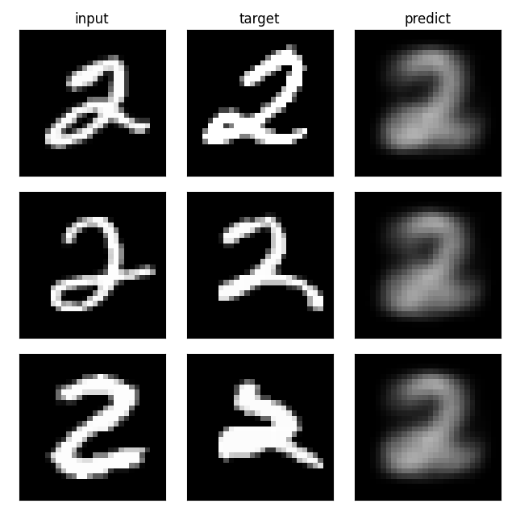
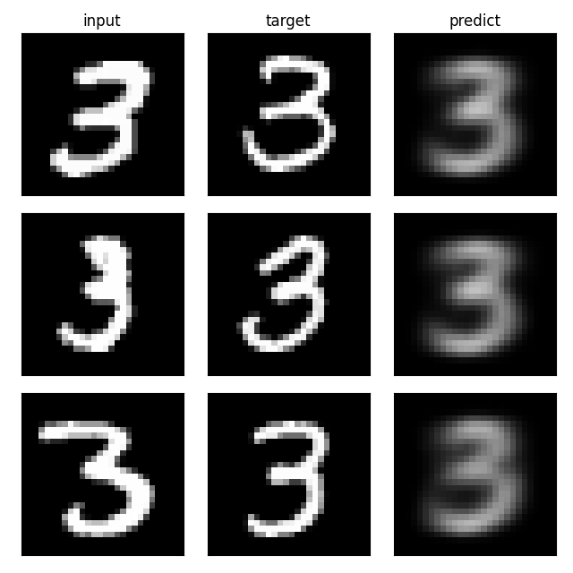
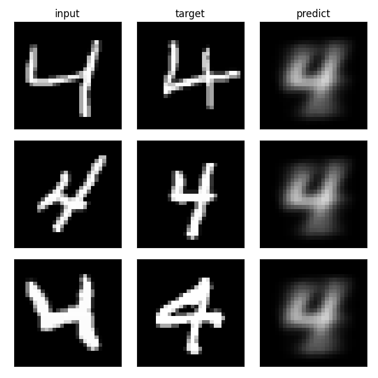
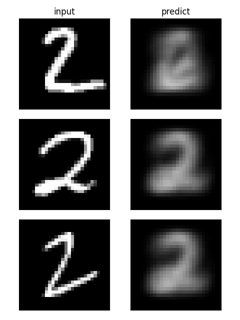
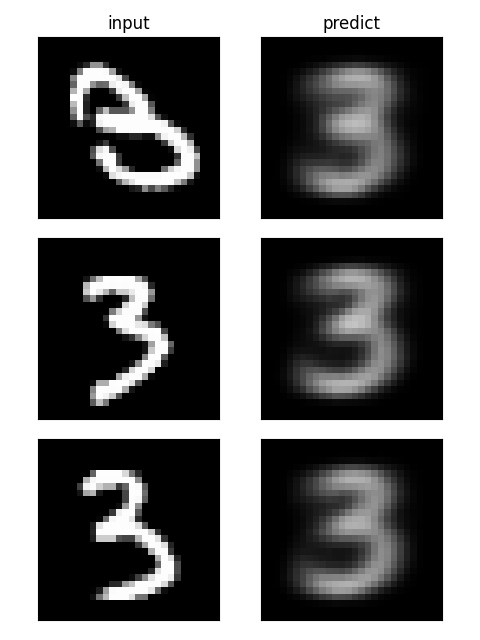
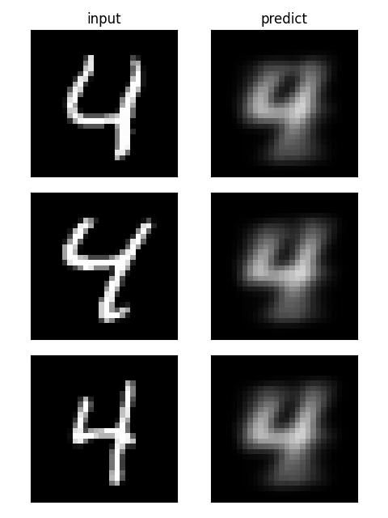

# average-joe

Image convergence, leveraging similar concept as in image restoration methods like N2N [1], N2V [2], and Siamese network [3].

## Example training data

## Example test result

## Reference
[1] Noise2Noise: Learning Image Restoration without Clean Data ([arxiv](https://arxiv.org/abs/1803.04189))  
[2] Noise2Void - Learning Denoising from Single Noisy Images ([arxiv](https://arxiv.org/abs/1811.10980))  
[3] Siamese neural network ([Wikipedia](https://en.wikipedia.org/wiki/Siamese_neural_network))
